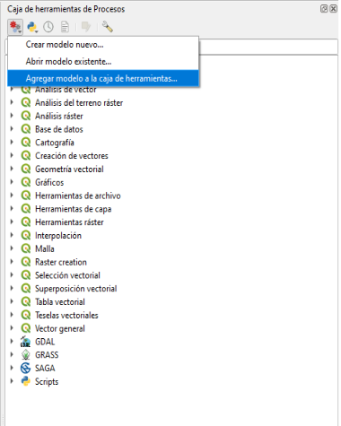

# **Modelo en QGIS para Estimar el Área Quemada y Severidad de la Quema**

El modelo ha sido desarrollado en el diseñador de modelos de QGIS 3.18, con el modelo podra delimitar el área quemada (Cicatriz) y la Severidad de la Quema utilizando imágenes satelitales Landsat 8 OLI e índices espectrales NBRI y dNBRI.

  

La metodologia esta basada en la siguiente literatura:

Lutes, D. C., Keane, R. E., Caratti, J. F., Key, C. H., Benson, N. C., Sutherland, S., & Gangi, L. J. (2006). FIREMON: Fire effects monitoring and inventory system. Gen. Tech. Rep. USDA Forest Service RMRS-GTR-164-CD. June, 1–55. https://doi.org/10.2737/RMRS-GTR-164

---
## **ALGUNOS ALCANCES**

Se puede usar tanto imágenes Landsat y Setinel 2.

- Los datos necesarios para el modelo son:

  - Stack de bandas del sensor que desea utilizar (Landsat 8 OLI o Sentinel 2), es necesario que cuente con un stack de bandas de antes del incendio (Pre) y otro de despues del incendio (Post).
  
  - Archivo .qml que contiene la simbologia para la capa raster de salida (Severidad).

**NOTA:** Las imágenes que van a ser utilizadas deben estar a nivel de reflectancia supefcial y recortadas de acuerdo al área de interés; adicionalmente puede contar con correcciones como Topográfica y enmascaramiento de Nubes, Agua o sombras, puesto que, pueden llegar causar errores en la estimacion tanto de la severidad como del área quemada.

---
## 1. Ejemplo Landsat:

- Pimero debemos agregar el modelo a la caja de herramientas de QGIS, para ello, vamos ala caja de herramientas  y en el boton de `Modelos` precionamos `Agregar modelo a la caja de herramientas`, luego simplemente debera buscar el modelos con el nombre **"MODELOS INCENDIOS FORESTALES.model3"**

   

- Luego debe cargar las bandas del sensor a utilizar, en este caso, usaremos las imágenes landsat previas y posteriores a la ocurrencia del incendio forestal (estas deben estar cortadas y corregidas a nivel de reflectancia superficial) que se encuentran en los directorios **"Imágen Previo al Incendio"** y **"Imágen Posterior al Incendio"** respectivamente.

 

- Con las imágenes cargadas se debe preparar las imágenes, creando un apilado de imagenes (Stack) o tambien llamado combinacion de bandas siguiendo el siguiente orden:

   - 1 -> RED (Banda 4).
   - 2 -> NIR (Banda 5).
   - 3 -> SWIR1 (Banda 6).
   - 4 -> SWIR2 (Banda 7).

  El apilado de badas se debe realizar para los 2 conjuntos de bandas (Pre y Post), para ello podemos usar complementos o la herramienta nativa de QGIS **`"Combinar"`**, respetando siempre el orden de las bandas  detallado lineas arriba.

 

 